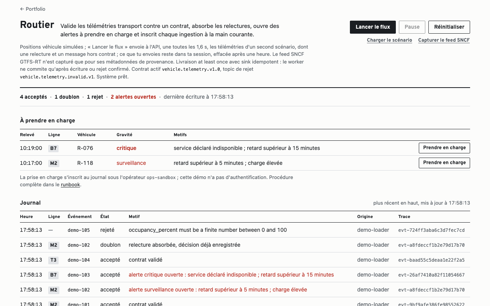

# Routier

Routier suit un événement transport du message à l'alerte : la télémétrie est validée contre un contrat versionné, une relecture Kafka est absorbée sans créer de doublon, des règles explicites fixent la priorité, puis un opérateur prend l'alerte en charge. Chaque étape laisse une trace consultable dans l'audit.

Démo : https://routier-ikel.onrender.com (instance gratuite Render, le premier chargement peut prendre une minute).



La capture montre la main courante telle qu'elle s'ouvre : le scénario de référence a déjà été ingéré (quatre télémétries acceptées, une relecture absorbée, un message hors contrat rejeté), deux alertes attendent leur prise en charge et le journal horodaté place l'écriture la plus récente en haut, avec l'identifiant de trace de chaque message.

« Lancer le flux » envoie ensuite à `POST /api/events`, une toutes les 1,6 s, les huit télémétries de `data/stream_events.jsonl`. Chacune passe par le vrai contrat et les vraies règles : la ligne s'inscrit en tête du journal avec son résultat, les compteurs suivent, une alerte apparaît à prendre en charge. Le flux contient une relecture volontaire (même `event_id`) et un retard négatif, pour voir le doublon absorbé et le rejet motivé. Pause, Reprendre et Réinitialiser restent disponibles.

Chaque onglet a sa propre base SQLite temporaire, créée depuis le scénario de référence et effacée après une heure : un visiteur ne voit jamais ce qu'un autre a envoyé. L'API limite à 45 messages par minute et par session, et à 120 écritures par minute et par adresse IP.

Les télémétries véhicule incluses sont synthétiques. Elles sont là pour rendre le système testable de bout en bout. Une synchronisation du feed public SNCF GTFS-RT Service Alerts est disponible séparément pour démontrer la provenance externe, sans jamais la présenter comme une position véhicule ou un retard réel.

## Ce que le système garantit

| Sujet | Choix implémenté | Ce que cela évite |
| --- | --- | --- |
| Contrat | `vehicle.telemetry` version `1.0`, timestamp avec fuseau, valeurs finies et bornes métier | Un message ambigu qui entrerait dans les règles métier |
| Relecture | `event_id` unique dans SQLite | Une même livraison Kafka qui créerait deux alertes |
| Livraison | Worker Kafka avec commit manuel après API ou DLQ confirmé | La perte silencieuse d'un message lors d'une coupure aval |
| Rejet | Topic `vehicle.telemetry.invalid.v1` et audit applicatif | Des événements invalides simplement ignorés |
| Décision | Règles, identifiants de règles, score de priorité et version de décision | Une alerte impossible à expliquer au métier |
| Opérations | Accusé de prise en charge distinct de la détection | Une file d'alertes qui ne reflète pas le travail réel |
| Provenance | Source, instant de capture, volume et empreinte GTFS-RT | Une donnée externe non traçable ou surinterprétée |

## Architecture

```text
producteur synthétique
        │ vehicle.telemetry.v1
        ▼
Redpanda / Kafka
        │
        ▼
worker Routier ── contrat invalide ──► vehicle.telemetry.invalid.v1
        │ commit manuel après effet durable
        ▼
API idempotente ──► SQLite events + ingestion_audit + acknowledgements
        │
        ├── /api/metrics, /api/audit, /api/alerts
        └── poste opérateur

feed SNCF GTFS-RT ──► adaptateur de provenance ──► feed_snapshots
```

Le worker est at least once. C'est volontaire : un arrêt entre la consommation Kafka et l'API peut provoquer une relecture, et le sink la transforme en réponse `duplicate` grâce à l'unicité de l'`event_id`. Ce n'est donc pas une promesse abstraite d'exactly once.

Le chemin de rejet suit la même règle. Si le worker s'arrête entre l'accusé du topic `vehicle.telemetry.invalid.v1` et le commit, le message rejeté y est publié une seconde fois. Chaque rejet porte donc l'`event_id` en clé Kafka (ou une empreinte SHA-256 du message quand l'identifiant manque) et un `rejection_id` stable : celui qui lit ce topic écarte la copie.

## Démarrage local

Prérequis : Python 3.11+.

```bash
PYTHONPATH=src python3 -m unittest discover -s tests
PYTHONPATH=src python3 -m routier.server
```

Ouvre `http://localhost:8080`, charge le scénario puis observe le journal. Le bouton de prise en charge est une action de sandbox, sans gestion des identités dans cette itération.

## Parcours Kafka complet

Prérequis : Docker et Docker Compose.

```bash
docker compose up --build
docker compose exec api python scripts/publish_demo.py
```

Le worker attend que Redpanda et l'API soient prêtes. Lorsqu'il remet un événement à l'API, il ne commite l'offset qu'après une réponse réussie, un doublon assumé ou une écriture confirmée dans le topic de rejet.

## API de la sandbox

Les routes de lecture et d'écriture acceptent un en-tête `X-Routier-Session` ; sans lui, elles travaillent sur la base partagée qu'utilise le worker Kafka.

| Route | Rôle |
| --- | --- |
| `GET /health` | Liveness de l'API |
| `GET /ready` | Disponibilité de la base et contrat actif |
| `GET /api/overview` | État opérationnel et derniers événements |
| `GET /api/metrics` | Compteurs acceptés, doublons, rejets et accusés |
| `GET /api/audit` | Journal de corrélation et d'ingestion |
| `GET /api/alerts` | Alertes encore actives |
| `POST /api/events` | Intégrer un événement conforme |
| `POST /api/alerts/{event_id}/acknowledge` | Accuser une alerte dans la sandbox |
| `POST /api/demo` | Charger le jeu synthétique |
| `GET /api/stream` | Messages du flux de démonstration et cadence |
| `POST /api/reset` | Ramener la session au scénario de référence |
| `POST /api/sources/sncf/sync` | Capturer les métadonnées du feed SNCF |

Le contrat, les exemples et les erreurs attendues sont détaillés dans [la fiche de contrat](docs/event-contract.md). Le [runbook](docs/runbook.md) explique le traitement d'une alerte et les limites assumées.

## Vérification

La suite couvre le contrat, les règles de décision, le chemin de rejet, l'idempotence, l'audit, l'accusé d'alerte, l'adaptateur GTFS-RT, l'isolation des sessions, les limites de débit, le flux de démonstration et, si `node` est installé, l'échappement et les textes de la page (`web/format.js`).

```bash
PYTHONPATH=src python3 -m unittest discover -s tests
```

## Limites assumées et suite

- SQLite rend la démonstration portable. Une exploitation multi-instance demanderait PostgreSQL ou TimescaleDB.
- La sandbox ne possède pas d'authentification, de RBAC ou de vrai opérateur. L'action d'accusé ne doit donc pas être prise pour un workflow d'entreprise complet.
- Les règles sont déterministes pour être relues. Leur calibration devrait être menée sur un historique gouverné et des objectifs de service partagés.
- La corrélation entre GTFS-RT et télémétrie n'est pas faite. Elle exigerait une clé de rapprochement, une conservation des snapshots et une évaluation du risque de faux rapprochement.

Pour les arbitrages et le protocole de revue, voir le [working paper](docs/working-paper.md).
